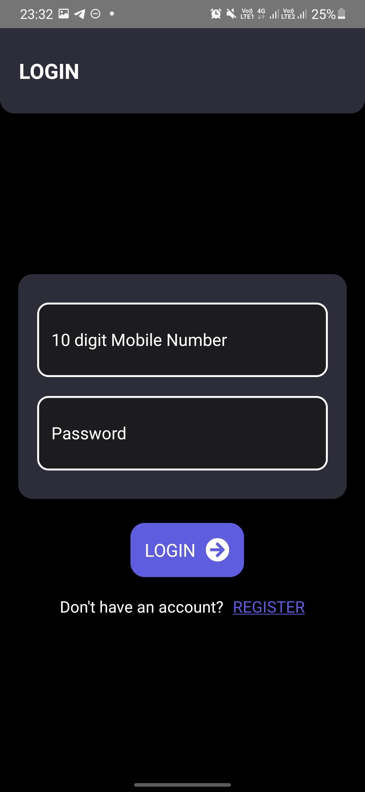
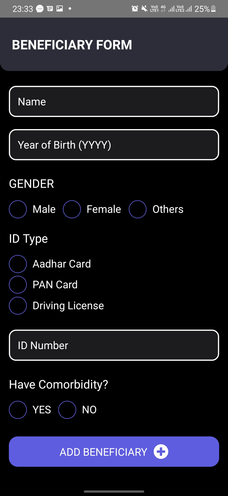
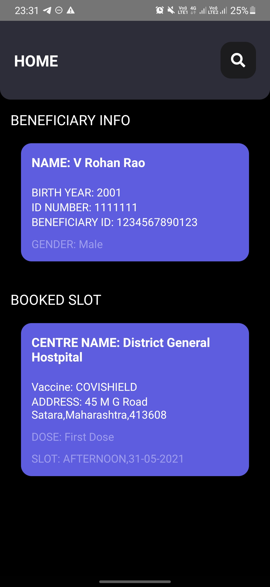

# **Soch App**

## **About the App**

With the onset of the vaccination drive in India, the Government of India has taken a very decisive action of centralising Covid-19 vaccination through the Co-Win portal.

However, being an online service, it is still is out of reach of millions of people who do not have stable internet connection. We aim to build a tool that empowers the common man to book vaccination slots without internet connectivity.

## **Objectives**

- Soch will bring this population of decentralised offline users to the Co-Win system, to help gauge the reach of the vaccination drive and to regulate the industry to make sure that the common populace doesn't need to resort to black marketers.

- Soch will employ good data practices to make sure sensitive data sent via the solution aren't open to exploitation.

- Soch can be used to make intelligent contact tracing apps and SOS services in the time of this dire pandemic.

## **Technologies Used**

- **Front-end Android App** - React Native and Java
- **Communication Network** - Bridgefy SDK
- **Back-end service** - Django Rest Framework, SQL, Redis, Celery
- **Backup Communication Channel** - SMS via Twilio

## **Resources Used**

- CoWin Public API

## **Contributors**

- [V Rohan Rao](https://github.com/v-rohan)
- [Nikhil Kumar](https://github.com/kumanik5661)
- [Souparno Paul](https://www.github.com/Soupaul)
- [Nirvik Agarwal](https://www.github.com/nirvikagarwal)

## **Instructions**

### **Frontend**

Build instructions:

1. Clone the repository.
2. Install react-native-cli by running `sudo npm install -g react-native-cli`.
3. Install yarn by running `sudo npm install -g yarn`.
4. Run `yarn` to install all dependencies.
5. Run `cp .env.example .env`.
6. Obtain API_KEY for Bridgefy SDK [here](https://bridgefy.me/sdk-legacy/).
7. Add the hosted BACKEND_URL to .env.
8. Start the Metro Server by running `yarn start`.
9. Run the app on an AVD or physical device by running `react-native run-android`.

### **Backend**

Build instructions:

1. Create a python virtual environment.
2. Run `pip install -r requirements.txt`.
3. `cp .env.example .env`.
4. Run `./manage.py makemigrations && ./manage.py migrate`.
5. Install redis and start its service.
6. Run `celery -A soch worker -l info`.
7. Run `./manage.py runserver`.

## **Screenshots**

